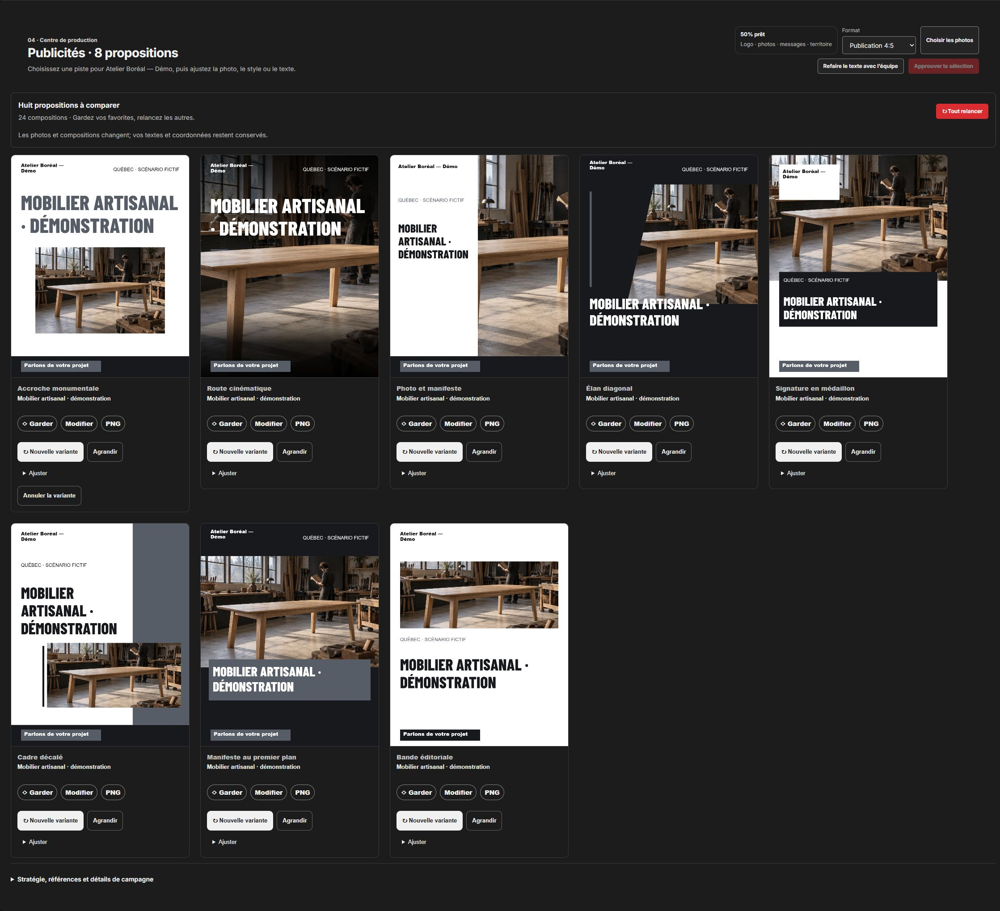
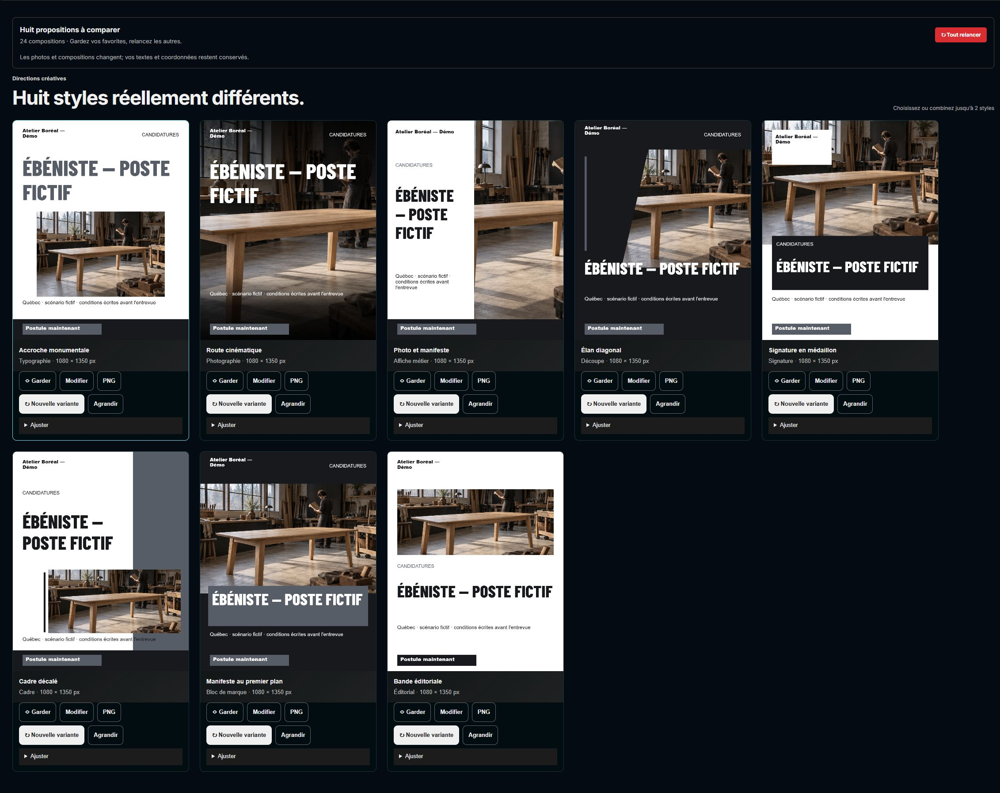
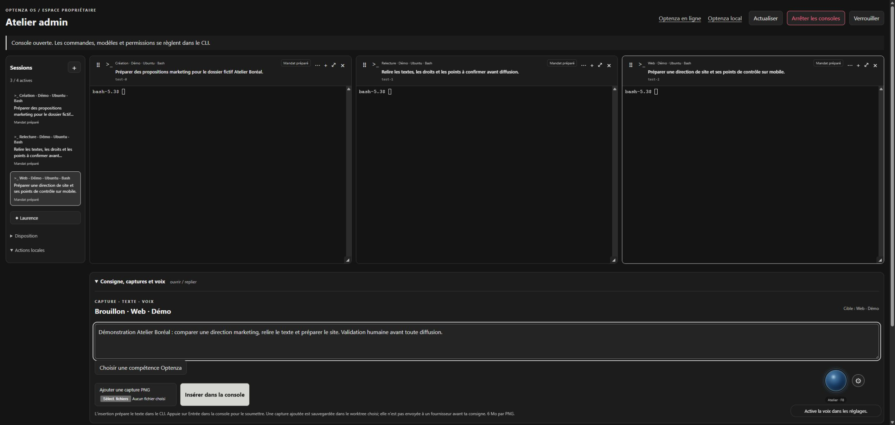
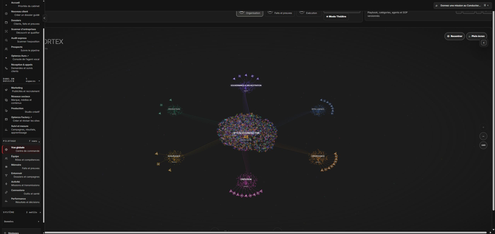
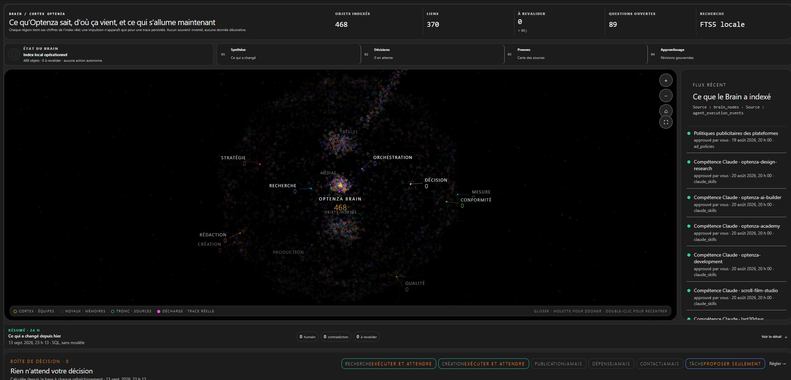
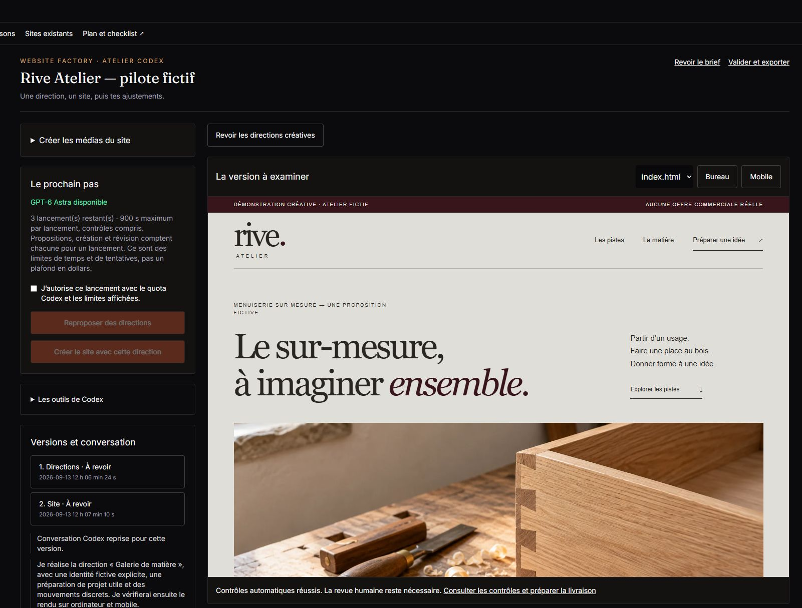
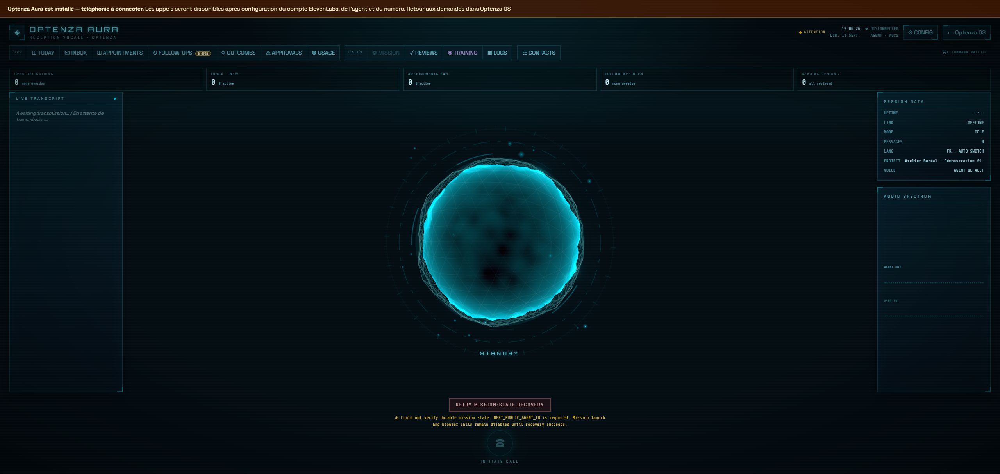
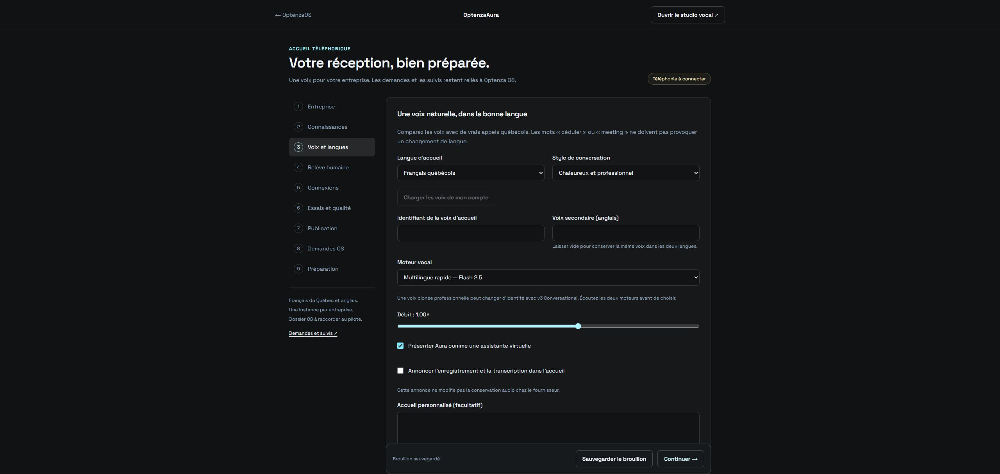
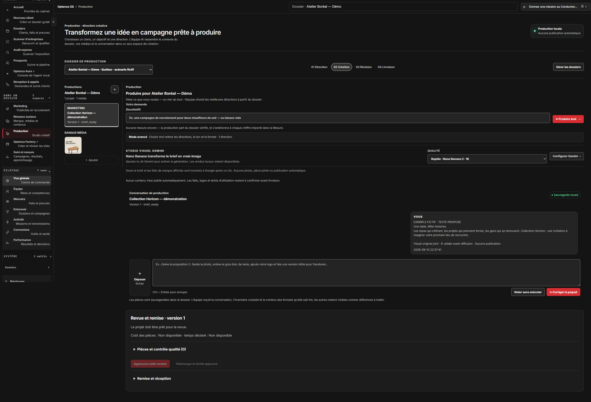

# Optenza OS — galerie du produit

Présentation du produit en développement. Les entreprises, les campagnes et le poste montrés sont fictifs.

[Visite de 45 secondes](assets/optenza-demo-45s.mp4) · [Provenance](PROVENANCE.md) · [Droits](DROITS.md)

## Marketing

Huit compositions affichées dans le produit pour Atelier Boréal, une entreprise fictive. La photographie illustrative a été générée séparément par IA puis composée par l’application.

## Recrutement

Huit propositions pour un poste fictif d’ébéniste. Les textes, les formats et les choix de composition sont visibles dans le véritable espace de recrutement.

## Console

Trois consoles locales et leurs mandats de démonstration : création, relecture et Web. Les espaces sont ouverts ; aucune mission n’a été soumise aux agents.

## Conductor

La vue de coordination déjà retenue est conservée. Elle montre les rôles et leur organisation dans une version locale du produit.

## Brain

Le cortex affiche l’index local, ses sources et les questions ouvertes. Les compteurs appartiennent à l’environnement de démonstration, sans activité de mission simulée.

## Website Factory

Vue réelle du pilote fictif Rive Atelier : directions, versions et aperçu du site à examiner. Ce pilote existait déjà ; aucun nouveau lancement n’a été effectué pour cette capture.

## Aura · studio vocal

Le studio vocal d’Aura, en attente de connexion. Cette capture présente l’interface ; elle ne montre pas un appel réel.

## Aura · configuration

Réglages de l’accueil en français québécois et en anglais, ton et présentation de l’assistante. Brouillon fictif ; téléphonie non connectée dans cette démonstration.

## Studio · complément

Vue complémentaire du projet fictif Collection Horizon, avec les notes et le média préparés pour la première proposition.

